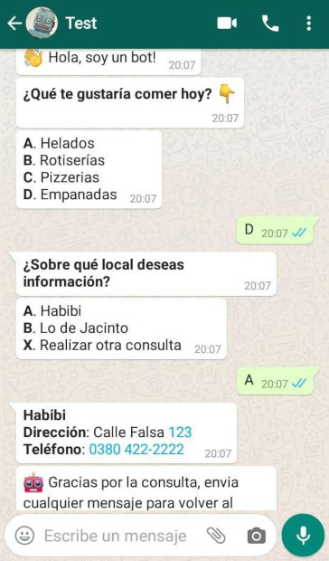
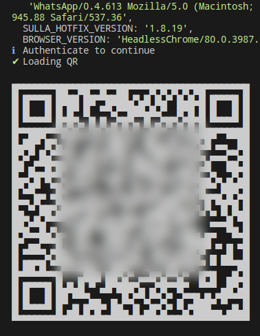

# Whatsapp Web Bot

Bot para WhatsApp Web usando sulla y keyv para manejo de sesiones.

---

## Instalar dependencias

`yarn install`

---

## Ejecutar

`yarn start`

En un celular con WhatsApp hay que scanear el código generado en la terminal.

